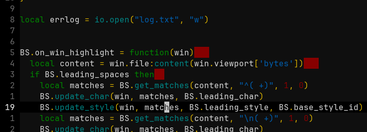
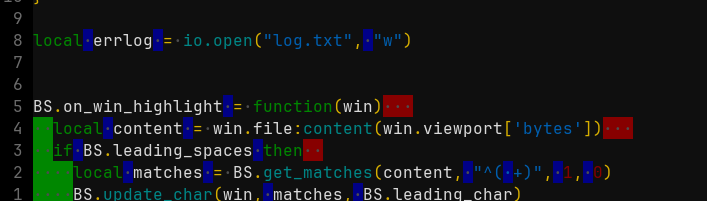

# VIS - Leading trailing spaces

This is a vis plugin allowing you to configure the style of leading, trailing
and middle spaces.

## Installation

You can install this plugin like any other vis plugin

For instance, clone the repo into you `.config/vis/plugins/` directory, then add
this line in your `visrc`:

`require('plugins/vis-ltspaces')`

## Configuration

There are several options you can configure:

* `leading_spaces` (boolean, default=`false`): set to `true` to apply a style tp leading spaces
* `trailing_spaces` (boolean, default=`true`): set to `true` to apply a style to trailing spaces
* `other_spaces` (boolean, default=`false`): set to `true` to a style to spaces in the middle of lines
* `leading_style` (string, default=`'back:#008800'`): the style of leading spaces (same format as in theme files)
* `trailing_style` (string, default=`'back:#880000'`): the style of trailing spaces
* `other_style` (string, default=`'back:#000088'`): the style of spaces in the middle of lines
* `base_style_id` (number, default=`60`): the style IDs on which the plugin is based. The plugin will use this one and the two following (so by default, it will use the IDs `60`, `61` and `62`). Change this only if there are conflicts with other plugins. Max value is `64`.

## Examples

The default configuration looks like this:

You can use `showspaces` along with this plugins. With all spaces stylized, it may look like this:

